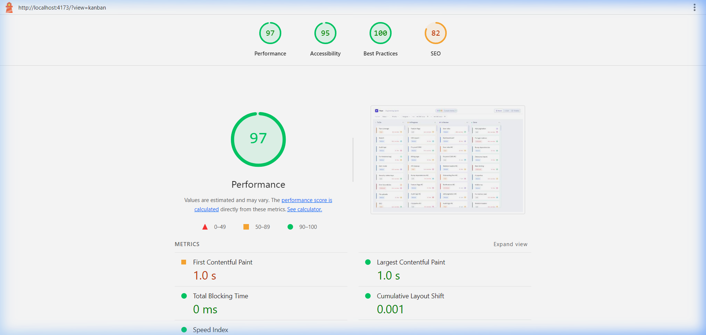

# project-tracker

Project management UI for a frontend challenge. Three views of the same data — kanban board, sortable list, and a Gantt timeline — with custom drag-and-drop, virtual scrolling, simulated live presence, and URL-synced filters. No UI libraries, no DnD libraries, no virtualization libraries.

**Live demo:** [project-tracker-five-tau.vercel.app](https://project-tracker-five-tau.vercel.app)

Stack: React + TypeScript + Tailwind CSS + Zustand

---

## Running it

```bash
npm install
npm run dev       # localhost:5173
npm run build
npm run preview   # test the production build locally
```

Node 18+ required, no env vars needed.

---

## Why Zustand

Context + useReducer would mean any filter change rerenders the whole tree. With Zustand, components subscribe to exactly the slice they read — nothing else rerenders. That matters when you're filtering/sorting 520 tasks across three views simultaneously.

The store only owns mutations (`moveTask`, `setFilters`, `setSort`). The actual filter and sort logic is plain functions called with `useMemo` at the component boundary, which makes them easy to test independently and keeps the store small.

---

## Virtual scrolling

Built from scratch in both the List view (`ROW_H = 52`, `BUFFER = 5`) and the Timeline view (`ROW_H = 44`, `BUFFER = 3`).

Container height is measured after mount with `useLayoutEffect` + `ResizeObserver` so the windowing math is accurate before the first paint. Without this the initial `clientHeight` is null and you get a blank strip on tall monitors.

The outer container has `height = taskCount × ROW_H`. That keeps the scrollbar accurate even when most rows aren't in the DOM. An `onScroll` handler updates `scrollTop` state, which drives the windowing math:

```
startIdx = max(0, floor(scrollTop / ROW_H) - BUFFER)
endIdx   = min(total, ceil((scrollTop + viewH) / ROW_H) + BUFFER)
```

Only `visibleTasks.slice(startIdx, endIdx)` is rendered, offset by `paddingTop = startIdx × ROW_H` so each row sits at the correct scroll position. On fast scrolls the buffer of 5 (list) or 3 (timeline) rows above and below prevents blank gaps.

When filters change the task list, a `useEffect` resets `scrollTop` to 0 so you don't end up mid-scroll in an empty region.

---

## Drag and drop

Pointer Events only — a single `onPointerDown` → `pointermove` → `pointerup/cancel` loop handles mouse, touch, and pen identically with no code branching.

**How it works:** `onPointerDown` calls `setPointerCapture` on the card so all subsequent events route to it regardless of where the finger moves. All drag state (clone, placeholder, offsets, hover column) lives in a single `useRef<DragState>` — zero re-renders during the whole drag. Only the final drop triggers one Zustand `moveTask` call.

**Ghost clone:** The card's DOM node is deep-cloned and appended to `document.body` as a `position: fixed` element with a slight rotation and drop shadow. The original card is hidden (`opacity: 0`) and a dashed-border placeholder is inserted in its place so the column layout never changes during the drag.

**Column detection:** Each column has a `data-col-status` attribute. On every `pointermove` the clone is hidden for a tick, `elementFromPoint` finds what's underneath, and a parent-walk finds the closest column. The hovered column gets a subtle background tint.

**Placeholder positioning:** On each `pointermove`, sibling cards in the target column are queried and a mid-point hit-test decides where to insert the placeholder — if the cursor is above a card's midpoint, the placeholder goes before it; otherwise it stays at the bottom.

**Snap-back:** If the pointer is released outside a valid column (or on the same column), the clone animates back to its origin coordinates via CSS transitions. A `transitionend` listener cleans up the clone, placeholder, and restores the original card's opacity. Dropping on the same column triggers a brief 3-frame shake animation before snapping back.

**Auto-scroll:** During drag, if the cursor is within 56px of the top or bottom edge of the hovered column's scroll area, the column auto-scrolls proportionally (faster near the edge, slower further away).

---

## Seed data

`src/data/seed.ts`, generates 520 tasks by default.

Title pool is about 30 entries — short names like "Auth service", "Rate limiting", "Fix login redirect". They repeat across 520 tasks with `#2`, `#3` suffixes, which is how carry-over work looks on a real board.

- Priority distribution: weighted toward medium/low (realistic)
- First 45 tasks are overdue so there's always something in the red
- ~20% have no start date, exercising the single-day marker in the timeline

---

## Project structure

```
src/
  types/       shared interfaces
  data/        seed generator + user list
  store/       Zustand store, filter/sort selectors
  hooks/       useURLFilters, useCollaboration
  utils/       date formatting, status/priority constants
  components/  Header, FilterBar, TaskCard, PresenceAvatar
  views/       KanbanView, ListView, TimelineView
```

Views get `tasks` and `presenceMap` as props. Switching views is instant — same filtered array in memory, no fetch.

---

## Lighthouse

Tested against the production build (`npm run build && npm run preview`). Gzipped bundle is about 56 KB JS and 4.6 KB CSS. Tailwind purges unused classes, Google Fonts use `display=swap`, nothing render-blocking.

| Category | Score |
|---|---|
| Performance | 97 |
| Accessibility | 95 |
| Best Practices | 100 |
| SEO | 82 |



---

## Deploy

```bash
npx vercel
# or push to GitHub and import on vercel.com
```

`vercel.json` has the `/* → /index.html` rewrite so deep-linked filter URLs survive page reloads.

---

## Submission explanation (247 words)

The hardest UI problem was the drag placeholder without layout shift. Every naive approach — removing the card from the DOM and inserting a placeholder — causes a visible flicker because the layout change and insertion can't be atomic in the same frame.

The fix was to never remove the card from the DOM at all. When a drag starts, `onPointerDown` captures the card's bounding rect and deep-clones it as a fixed-position ghost. The original card stays in place but is hidden with `opacity: 0`. A dashed placeholder `<div>` with the same height is inserted before the hidden card. Because flexbox sees the same total height — `originalCard(opacity:0) + placeholder(same height)` — no reflow happens and the column stays perfectly stable throughout the drag.

How the placeholder avoids layout shift specifically: the card's height is captured from `getBoundingClientRect()` in the pointer-down handler — before any DOM mutation. The placeholder is inserted imperatively (`insertBefore`) in the same synchronous block. By the time the browser paints the next frame, the layout is already stable with the placeholder occupying the exact same space.

All drag state lives in a single `useRef` — clone element, placeholder, offsets, source status, current hover column. This means zero React re-renders fire during the entire drag operation. Only the final cross-column drop dispatches one Zustand `moveTask` call.

One thing I'd refactor with more time: the imperative DOM updates for column badges and empty-state visibility during drag. They work correctly but they're fragile — a `data-col-count` selector could break if the badge markup changes. I'd explore a `useSyncExternalStore`-based approach that lets React own those updates without triggering full re-renders.
